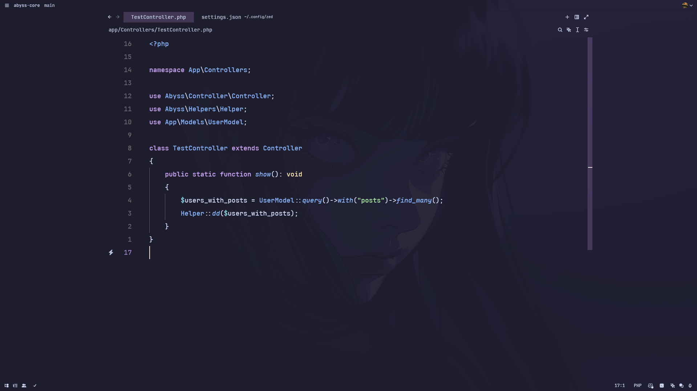
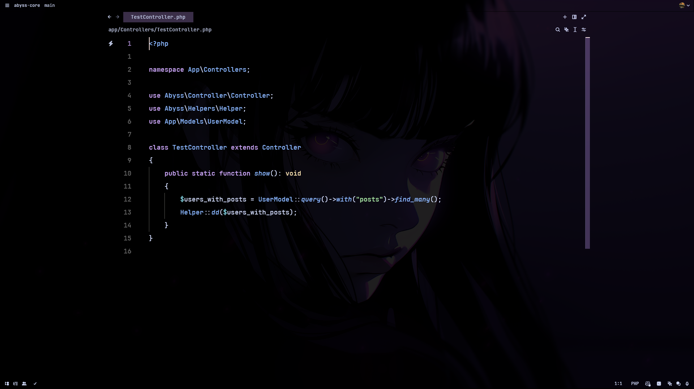

# Zed setup

To toggle center layout execute in command `workspace: toggle centered layout`

## Themes

For themes I added customization:

### Catpuccin Mocha (blur)

```json
"experimental.theme_overrides": {
  // * Catpuccin Mocha (blur)
  "background": "#1e1e2ef3",
  "elevated_surface.background": "#181825",
  "surface.background": "#1e1e2ed0",
  "status_bar.background": "#1e1e2ef3",
  "title_bar.background": "#1e1e2ef3"
}
```



### Catpuccin Espresso (blur)
```json
"experimental.theme_overrides": {
  // * Catpuccin Mocha (blur)
  "background": "#000000e0",
  "elevated_surface.background": "#181825",
  "surface.background": "#000000e0",
  "status_bar.background": "#000000e0",
  "title_bar.background": "#000000e0"
}
```

